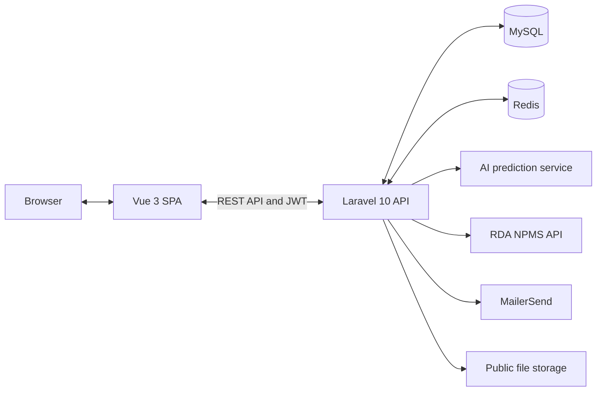

<div align="center">

# Plant Disease Detection Web

AI-based crop disease diagnosis and an integrated plant disease guide,
built as a decoupled Vue and Laravel application.

[](https://vuejs.org/)
[](https://laravel.com/)
[](https://www.php.net/)
[](https://redis.io/)
[](https://tailwindcss.com/)

</div>

## Overview

Plant Disease Detection Web helps users diagnose crop diseases from an uploaded image and explore detailed disease information supplied by Korea's Rural Development Administration. The frontend and backend are completely separated: Vue provides the responsive single-page interface, while Laravel handles authentication, prediction requests, result history, caching, and external API integration.

The current diagnosis flow supports five crops: **potato, strawberry, tomato, peach, and grape**.

## Screenshots

<p align="center">
  
  
</p>
<p align="center">
  
  
</p>
<p align="center">
  
</p>

## Key Features

| Feature | Description |
| --- | --- |
| AI image diagnosis | Upload a crop image, select its crop type, and receive the predicted crop, disease, and confidence score. |
| Supported crops | Diagnose potato, strawberry, tomato, peach, and grape images. |
| Disease guide | Search diseases by crop or disease name and view images, symptoms, development conditions, and prevention methods. |
| Result history | Review paginated diagnosis results, open related disease information, submit a correction, or delete a result. |
| Account system | Register with email verification, sign in with JWT credentials, or use Google login. |
| Duplicate detection | Reuse an existing result when the same image hash has already been analyzed. |
| Redis caching | Cache Rural Development Administration API results for six hours to reduce response time and external API traffic. |
| Responsive and multilingual UI | Provide desktop and mobile layouts with Korean and English translations. |

## Architecture



The Vue application calls the Laravel API through Axios. Laravel delegates image inference to a separate prediction service, enriches the result with disease data from the RDA NPMS API, and stores user and diagnosis records in MySQL. Redis holds external disease API responses and short-lived verification data.

Authentication differs by environment:

- In development, the JWT is returned in the response and attached as a Bearer token.
- In production, the JWT is stored in a secure, HTTP-only cookie.

## Tech Stack

| Area | Technologies |
| --- | --- |
| Frontend | Vue 3, Vite, Vue Router, Pinia, Axios |
| UI | Tailwind CSS, daisyUI |
| Internationalization | Vue I18n |
| Backend | Laravel 10, PHP 8.2+ |
| Authentication | JWT Auth, Google ID token login |
| Database | MySQL, Eloquent ORM |
| Cache | Redis |
| Email verification | MailerSend API |
| File storage | Laravel public disk, with Flysystem S3 support available |
| External data | RDA National Crop Pest Management System API |
| AI integration | Separate prediction API configured through `PREDICT_URL` |

## Project Structure

```text
.
|-- backend/                 Laravel REST API
|   |-- app/
|   |   |-- Http/Controllers/
|   |   |-- Models/
|   |   `-- Services/
|   |-- config/              Service, database, cache, JWT, and CORS settings
|   |-- database/            Migrations and factories
|   |-- routes/api.php       API route definitions
|   `-- Dockerfile           Backend container image
|-- vue/                     Vue single-page application
|   |-- src/
|   |   |-- components/      Pages, modals, navigation, and authentication UI
|   |   |-- lib/             Axios and authentication helpers
|   |   |-- locales/         Korean and English translations
|   |   |-- router/          Client-side routes and navigation guards
|   |   `-- stores/          Pinia stores
|   `-- vite.config.js
`-- vue.zip                  Archived frontend snapshot
```

## Getting Started

### Prerequisites

- PHP 8.2 or later
- Composer
- Node.js 18 or later and npm
- MySQL
- Redis with the PHP Redis extension
- An accessible AI prediction service
- An RDA NPMS API key
- MailerSend and Google OAuth credentials when using those features

### 1. Clone the repository

```bash
git clone https://github.com/jihyoung-lee/-Plant_Disease_Detection_Web_v2.git
cd ./-Plant_Disease_Detection_Web_v2
```

### 2. Configure and run the backend

```bash
cd backend
composer install
cp .env.example .env
php artisan key:generate
php artisan jwt:secret
```

Update `backend/.env` with your local services and credentials. The following values are the main project-specific settings:

```env
APP_ENV=local
APP_URL=http://127.0.0.1:8000
FRONTEND_URL=http://localhost:5173

DB_CONNECTION=mysql
DB_HOST=127.0.0.1
DB_PORT=3306
DB_DATABASE=plant_disease
DB_USERNAME=root
DB_PASSWORD=

CACHE_DRIVER=redis
REDIS_HOST=127.0.0.1
REDIS_PASSWORD=null
REDIS_PORT=6379

RDA_API_KEY=your_rda_api_key
API_URL=http://ncpms.rda.go.kr/npmsAPI/service
PREDICT_URL=http://127.0.0.1:5000/predict

MAILERSEND_API_KEY=your_mailersend_api_key
GOOGLE_CLIENT_ID=your_google_client_id
GOOGLE_CLIENT_SECRET=your_google_client_secret
```

Prepare the database and public image directory, then start Laravel:

```bash
php artisan migrate
php artisan storage:link
php artisan serve
```

The API is available at `http://127.0.0.1:8000/api` by default.

### 3. Configure and run the frontend

Open another terminal:

```bash
cd vue
npm install
cp .env.example .env
```

Set the frontend environment variables:

```env
VITE_API_BASE_URL=http://127.0.0.1:8000/api
VITE_GOOGLE_CLIENT_ID=your_google_client_id
```

Start the Vite development server:

```bash
npm run dev
```

The frontend is available at `http://localhost:5173` by default.

> The AI model service is not included in this repository. It must accept a multipart image and crop name at the URL configured by `PREDICT_URL`, then return `cropName`, `sickNameKor`, and `confidence` fields.

## API Overview

| Method | Endpoint | Purpose | Authentication |
| --- | --- | --- | --- |
| `POST` | `/api/register` | Create a user account | Public |
| `GET` | `/api/check-email` | Check email availability | Public |
| `POST` | `/api/notification` | Send a verification code | Public |
| `POST` | `/api/verify` | Verify an email code | Public |
| `POST` | `/api/resend-code` | Send a new verification code | Public |
| `POST` | `/api/login` | Sign in and issue a JWT | Public |
| `POST` | `/api/auth/google` | Sign in with a Google ID token | Public |
| `POST` | `/api/logout` | Invalidate the current JWT | JWT |
| `GET` | `/api/me` | Return the current user | JWT |
| `GET` | `/api/diseases` | Search the disease guide | Public |
| `GET` | `/api/disease-info` | Return detailed disease information | Public |
| `GET` | `/api/results` | List the current user's diagnosis history | JWT expected |
| `GET` | `/api/results/{id}` | Return one diagnosis result | JWT expected |
| `DELETE` | `/api/results/{id}` | Delete a diagnosis result | JWT expected |
| `GET` | `/api/predict` | List recent prediction records | JWT |
| `POST` | `/api/predict` | Upload and diagnose an image | JWT |
| `POST` | `/api/predict/{id}/opinion` | Save a corrected crop and disease label | JWT |

### Disease search example

```http
GET /api/diseases?type=1&search=사과&page=1
```

```json
{
  "data": [
    {
      "cropName": "사과",
      "sickNameKor": "검은별무늬병",
      "oriImg": "https://example.com/image.jpg"
    }
  ],
  "pagination": {
    "current_page": 1,
    "per_page": 5,
    "total": 33,
    "last_page": 7
  }
}
```

Use `type=1` to search by crop name. Other values search by Korean disease name.

## Redis Cache Strategy

RDA API responses are cached for six hours. Pagination is performed after the complete disease list has been retrieved from the cache.

| Data | Cache key |
| --- | --- |
| Disease list | `disease_list_{searchType}_{urlEncodedSearch}` |
| Disease detail | `disease_info:{urlEncodedCropName}:{urlEncodedSickNameKor}` |

Email availability checks are cached for 10 seconds, while verification and verified-email data are kept for 30 minutes.

## Validation and Build

Run the backend test suite:

```bash
cd backend
php artisan test
```

Create a production frontend build:

```bash
cd vue
npm run build
```

The backend also includes a `Dockerfile` and `start.sh` for container-based deployment. Runtime database, Redis, mail, prediction, and RDA credentials must be supplied as environment variables.

## External Data Source

Disease names, images, symptoms, development conditions, and prevention information are retrieved from the [RDA National Crop Pest Management System](http://ncpms.rda.go.kr/).
